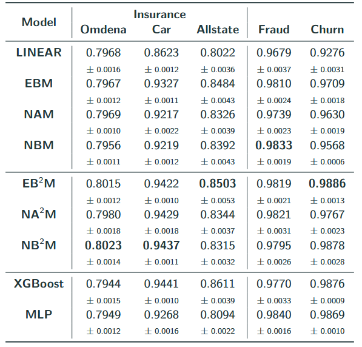

# Explainable AI: GAM-Based Transparent Models & Post-hoc Methods

Overview

This repository contains implementations of GAM-based transparent models, including Neural Additive Models (NAM) and Neural Basis Models (NBM). These models have been applied to various financial (e.g., Loan Default Prediction) and non financial datasets, demonstrating their effectiveness through performance evaluations and visualization plots.

Additionally, this project explores post-hoc explanation methods, such as SHAP (SHapley Additive Explanations) and LIME (Local Interpretable Model-agnostic Explanations). Simple sentiment classification experiments were conducted to illustrate their functionality, while further analysis was performed on tabular datasets to assess their sensitivity to noise. Through systematic experimentation, this repository provides insights into how SHAP and LIME react to perturbations in input data.

## Model Performance Comparison

Test-set performance (mean ± std). This table summarizes the AUROC scores of various interpretable and black-box models across five binary classification tasks. Among them, three tasks involve insurance claim prediction (Omdema, Car, Allstate), one task is for fraud detection (Fraud), and one task for customer churn prediction (Churn). Higher is better, and bold values indicate the best performance per dataset.

